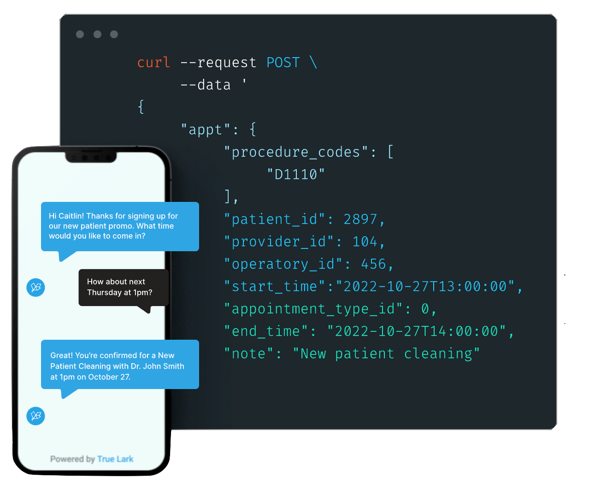

<h1>NexHealth QuickStart</h1>

If you're looking for the fastest way to test syncing with EHR systems - without writing code - this is the place to start.

**Want to skip the guide?**
Jump straight to the [NexHealth Postman Collection](https://docs.nexhealth.com/reference/introduction)

**Looking for full API docs or production setup?**
Check out the [NexHealth Developer Portal](https://developers.nexhealth.com/signup) for authentication, endpoints, and real-world examples.

**Prefer video?**
We’ve got a [Quickstart walkthrough in 3 minutes](https://www.youtube.com/watch?v=tTkbK4As1fA&list=PLL2Iy1oGVcCacoZ8VsvqKKnzRjNJ6R1ca) and a deeper dive on retry logic, errors, and mapping.

This repository accompanies [NexHealth's Quickstart Guide](https://developers.nexhealth.com/signup)

Here you will find a complete example of a simple online booking interface that uses the NexHealth Synchronizer API to schedule appointments.



- [Getting started](#getting-started)
- [Prerequisites](#prerequisites)
- [Clone the repository](#clone-the-repository)
- [Configuration](#configuration)
- [Installation](#installation)
- [Starting the Node server and Frontend app](#starting-the-node-server-and-frontend-app)
- [Performance](#performance)

## Getting started

Skip the API setup headaches and get hands-on with [NexHealth's Synchronizer API](https://docs.nexhealth.com/reference/introduction). This [Node.js](https://nodejs.org/en/) + [React](https://facebook.github.io/react/) repository gets you from zero to a working healthcare scheduling app in minutes.

Clone, configure your API key, and start booking real appointments through working examples of appointment creation, provider management, and patient scheduling that you can customize for your healthcare application.


## Prerequisites
- Node.js 18.x or higher (20.x recommended) ([Download here](https://nodejs.org/))
- npm 9.x or higher
- Opendental test server configured ([Guide here](https://docs.nexhealth.com/docs/setting-up-an-open-dental-test-server))


## Clone the repository

Using https:

```sh
git clone https://github.com/nex-health/api-quickstart.git
cd api-quickstart
```

Alternatively, if you use ssh:

```sh
git clone git@github.com:nex-health/api-quickstart.git
cd api-quickstart
```

## Configuration

1. To request access to the [NexHealth API](https://docs.nexhealth.com/reference/introduction), fill out this [form](https://www.nexhealth.com/api-request/request-access). You should receive a **subdomain**, a **location_id**, and an **API Key**.

2. Populate an `.env` file in `server/` with the credentials from above.

```sh
cd NexHealth
touch server/.env
```

Add values for the below properties:

| Properties  | Description                                                     |
| :---------- | :-------------------------------------------------------------- |
| API_URL     | Sandbox url e.g: https://sandbox.nexhealth.com |
| SUBDOMAIN   | Refers to a specific institution                                |
| LOCATION_ID | Refers to a specific location                                   |
| API_KEY     | API Key provided by NexHealth                                   |

Please use the sample `.env.example` located under the `server/` folder as a template.

```sh
API_URL=https://sandbox.nexhealth.com
SUBDOMAIN=xxxx
LOCATION_ID=xxxx
API_KEY=xxxx
```

> Note: `.env` files are convenient for local development. Do not run production applications using .env files.

Please contact the NexHealth team if you have any questions about these values.

## Installation

Install the required dependencies using the following command:

```sh

cd ./server
npm install

cd ./frontend
npm install

```

## Starting the Node server

Navigate to the server folder and run the following command:

```sh
cd ./server
npm run start
```

If everything is working, you should see the following message:

```sh
[nodemon] reading config .\nodemon.json
[nodemon] to restart at any time, enter `rs`
[nodemon] or send SIGHUP to 14688 to restart
[nodemon] ignoring: .git node_modules/**/node_modules
[nodemon] watching path(s): *.js routers\*.js
[nodemon] watching extensions: js,json
[nodemon] starting `node --harmony index.js`
[nodemon] spawning
[nodemon] child pid: 11036
[nodemon] watching 8 files
Server is running on port 4000
```

## Starting the Frontend app

To start the frontend app:

```sh
cd ./frontend
npm run start
```

If everything was set up correctly, you should be able to access the UI at the following url: http://localhost:3000/

## Performance

- On-Premise Systems (e.g., Dentrix, Eaglesoft, Open Dental): 
  - Read cycles: every 10–15 minutes
  - Write actions: typically under 30 seconds

- Cloud Systems:
  - Read: varies based on data type and system
  - Write: most write actions complete in 30–60 seconds
